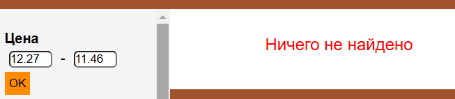
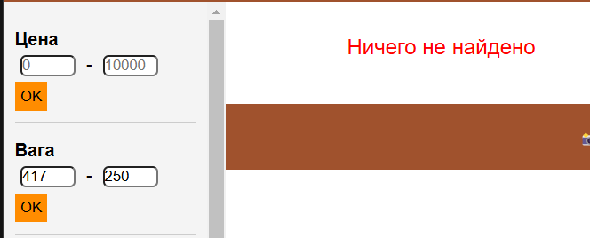

# Ошибка №1   Некоректная работа фильтров цены и веса
## Описание: 
Когда клиент вводит первую цифру в поле фильтра цены и веса(например 200), то когда он вводит вторую цифру, он может ее написать меньше, чем первая(напимер 150)
## Шаги для воспроизведения:
1. Поставить проверку для второго поля, чтобы нельзя было вводить цифру меньше чем в первом (например если в первом поле введена сумма 200, то во втором должна стоять цифра больше чем 200)
## Ожидаемый результат: выводится ошибка что вы ввели во втором поле цифру меньше чем в первом
## Фактический результат: во втором поле можно ввести цифру меньше
## Приоритет: Высокий

