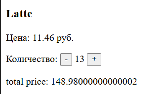

# Ошибка №2  Большая сумма в копейках 
## Описание: 
Если брать большое количество кофе у которого цена имеет копейки, то в какой то момент сумма становится очень большой
## Шаги для воспроизведение:

Сделать округление суммы до тысячных 
## Ожидаемый результат: 
Сумма будет писаться в формате : 00,00 гривен 
## Фактический результат: 
Сумма становится слишком большой и может иметь кучу цифр после запятой вместо двух 
## Приоритет:
Средний 
